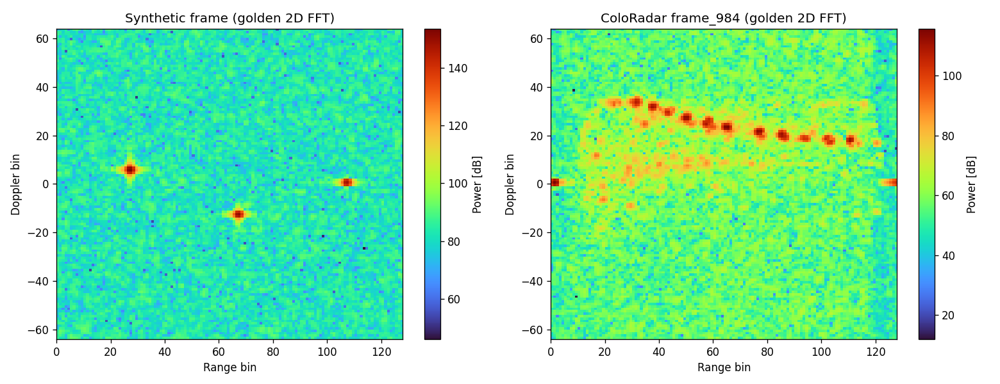
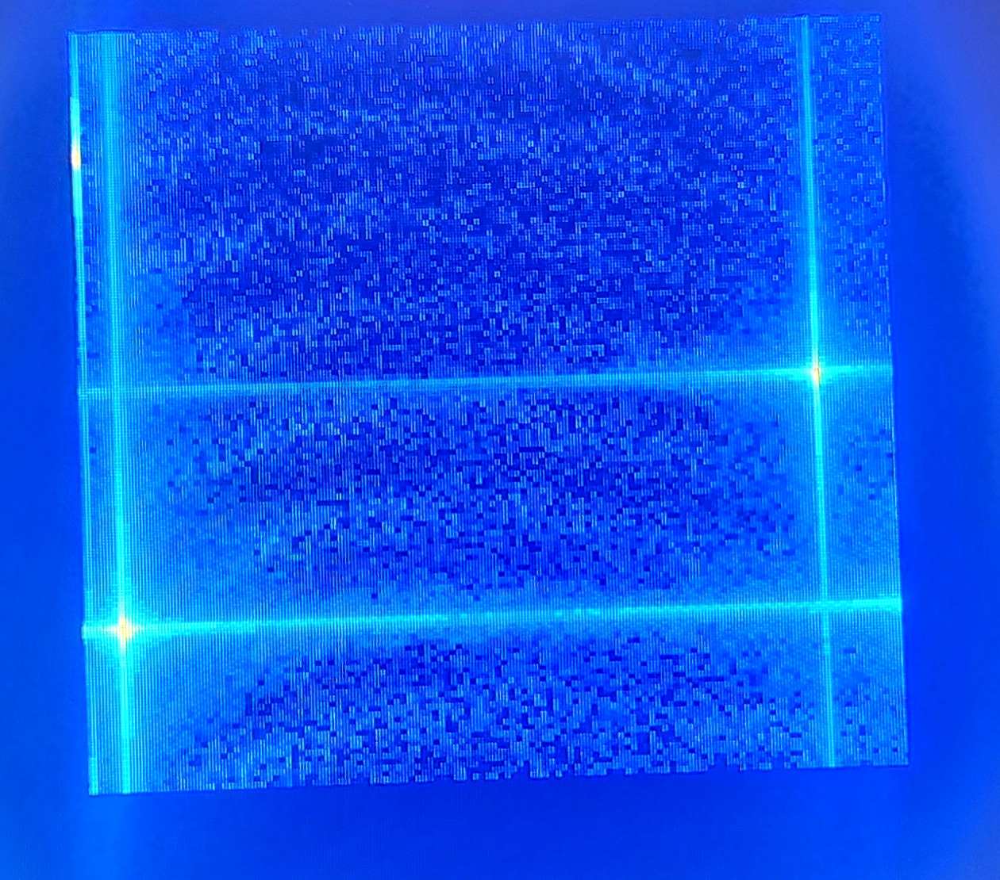
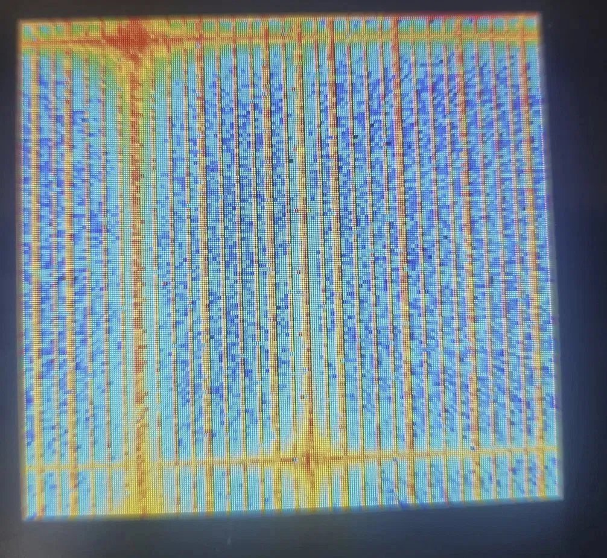

# FMCW 레이더 신호처리 하드웨어 구현 — Zynq-7020 2D FFT Range-Doppler Map

> 전북대학교 **디지털시스템설계** (2026-1학기, 4학년) 텀 프로젝트 · Vivado / Vitis 2023.2 · Verilog + C

실측 mmWave FMCW 레이더(ColoRadar 데이터셋)의 IQ 프레임을 SD카드로 받아,
**PS(ARM Cortex-A9)** 가 DDR에 적재하고 AXI DMA로 **PL(FPGA)** 에 스트리밍하면
PL이 **128 × 128 2D FFT (Range → Doppler) + 전력 계산**을 수행해 Range-Doppler Map을
800 × 480 TFT LCD에 히트맵으로 그리는 시스템입니다.

- 보드: Zynq **XC7Z020-CLG484-1** (ZedBoard 계열 ZSK 실습보드) + FMC LCD 모듈
- 프레임: 128 chirp × 128 sample, 16-bit I/Q (`{Q, I}` 32-bit/샘플, 64 KB/프레임)
- 레이더 파라미터(합성 데이터): f_c 77 GHz, B 4 GHz, T_c 40 µs

## 데이터 흐름

```
SD card (.bin) ─FatFs─▶ PS: DDR frame_buf ─AXI DMA MM2S─▶ pl_top (PL)
                                                             │
   range_fft (xfft IP, 128-pt) ─▶ corner_turn (ping-pong BRAM 전치)
   ─▶ range_fft (Doppler) ─▶ magnitude (I²+Q²) ─▶ rd_framebuffer (100 MHz 쓰기 / 33 MHz 읽기)
   ─▶ tft_pic (heat colormap, 2배 확대) ─▶ lcd_ctrl ─▶ LCD
```

스위치(AXI GPIO) 토글로 두 모드를 오갑니다.

| 모드 | 입력 | 용도 |
|---|---|---|
| 검증 | `synth.bin` (거리/속도를 아는 합성 타겟 3개) 반복 | 파이프라인 정확도 확인 |
| 실데이터 | `real_0000.bin`, `real_0001.bin`, … 순차 재생 | ColoRadar 프레임 실시간 표시 |

## 디렉터리

```
rtl/          PL 합성용 Verilog
sim/          테스트벤치, FFT IP behavioral 모델, 자극 파일(.mem)
constraints/  system.xdc (LCD · 스위치 핀)
sw/           Vitis standalone 앱 (main.c, 링커 스크립트)
scripts/      프레임 생성 파이썬 스크립트 (합성 타겟 / ColoRadar 추출, 골든 R-D 맵)
data/         SD카드용 샘플 프레임 (synth.bin, real_0000.bin)
vivado/       Vivado 프로젝트(2dfft.xpr), 블록디자인(system.bd), IP 설정(.xci), 내보낸 .xsa
docs/         블록디자인/Vitis 가이드, 결과 발표자료, 골든 R-D 맵 그림
```

### 모듈

| 파일 | 역할 |
|---|---|
| `rtl/pl_top.v` | PL 최상위. clk_wiz_0(100→33 MHz) + 2D FFT + 프레임버퍼 + 렌더러 + LCD 컨트롤러 통합 |
| `rtl/fft2d_pipeline.v` | Range FFT → corner-turn → Doppler FFT → magnitude 파이프라인 |
| `rtl/range_fft.v` | Xilinx FFT IP(`xfft_0`) AXI-Stream 래퍼. 리셋 후 config(순방향·스케일링 0xD5) 자동 전송 |
| `rtl/corner_turn.v` | N×N ping-pong BRAM. chirp-major로 쓰고 range-bin-major로 읽어 전치 |
| `rtl/magnitude.v` | 복소 스트림 → 32-bit 전력 (I²+Q²) |
| `rtl/rd_framebuffer.v` | N×N 전력 프레임버퍼. 쓰기/읽기 클럭 분리, 더블 버퍼 |
| `rtl/tft_pic.v` | R-D 맵을 화면 중앙에 2배 확대해 heat 컬러맵으로 픽셀 생성 |
| `rtl/lcd_ctrl.v` | 800×480 LCD 타이밍 컨트롤러 (수업 제공 코드) |
| `sim/xfft_0.v` | FFT IP의 behavioral 대체 모델. **시뮬레이션 전용**, Vivado 빌드에서는 제외 |
| `sim/tb_fft2d.v` | 2D FFT 통합 테스트벤치. `MODE` 0=내부 합성 / 1=`frame_synth.mem` → `fft_out.txt` 덤프 |
| `sw/main.c` | PS 펌웨어: SD 마운트(xilffs) → 프레임 읽기 → DMA 전송, GPIO로 모드 토글 |
| `scripts/gen_frame_vectors.py` | 합성/ColoRadar 프레임을 `.mem`으로 저장하고 numpy 골든 2D FFT 피크 출력 |
| `scripts/gen_sd_data.py` | SD카드용 `synth.bin`, `real_XXXX.bin` 생성 |

## 시뮬레이션 (iverilog)

```bash
cd sim
# 빠른 구조 확인: N=16, 내부 합성 타겟
iverilog -g2012 -DSIM -o tb.vvp -P tb_fft2d.N=16 -P tb_fft2d.MODE=0 \
  tb_fft2d.v xfft_0.v ../rtl/fft2d_pipeline.v ../rtl/range_fft.v ../rtl/corner_turn.v ../rtl/magnitude.v
vvp tb.vvp
# 실제 크기: N=128, frame_synth.mem 입력 → fft_out.txt (range*N + doppler 순서, hex)
iverilog -g2012 -DSIM -o tb.vvp -P tb_fft2d.N=128 -P tb_fft2d.MODE=1 ... && vvp tb.vvp
```

`-DSIM`이 있으면 `range_fft.v`가 파라미터화된 behavioral `xfft_0`을, 없으면 Vivado IP를 인스턴스합니다.

## Vivado / Vitis 빌드

1. `vivado/2dfft.xpr` 열기 (소스 경로는 저장소 상대경로로 정리해 두었습니다).
   IP: `xfft_0` (128-pt, Pipelined Streaming, 16-bit scaled, natural order), `clk_wiz_0` (100 → 33 MHz).
   블록디자인 `system.bd`: ZYNQ7 PS + AXI DMA(MM2S) + AXI GPIO + `pl_top`. 절차는 [docs/BLOCK_DESIGN_GUIDE.md](docs/BLOCK_DESIGN_GUIDE.md).
2. Generate Bitstream → Export Hardware(`system_wrapper.xsa`, 저장소에 포함).
3. Vitis: `.xsa`로 platform 생성 → BSP에 **xilffs** 켜기 → Empty C 앱에 `sw/main.c` 추가. 절차는 [docs/VITIS_GUIDE.md](docs/VITIS_GUIDE.md).
4. `data/*.bin`을 SD카드 루트에 복사 후 JTAG 또는 SD 부팅.

## 결과



왼쪽은 합성 3타겟(range 27/67/107, doppler +5/−13/0), 오른쪽은 ColoRadar `frame_984`를 numpy로 계산한 골든 2D FFT입니다.
RTL 시뮬레이션(`fft_out.txt`)과 실제 LCD 출력에서 같은 위치에 피크가 나타나는 것을 확인했습니다.
실제 보드의 LCD 출력 (가로 Doppler · 세로 Range):

| 검증 모드 (합성 3타겟) | 실데이터 모드 (ColoRadar) |
|---|---|
|  |  |

검증 과정 전체는 [docs/FMCW_레이더_결과발표.pptx](docs/FMCW_레이더_결과발표.pptx)에 있습니다.

## 비고

- ColoRadar 프레임 덤프 전체(약 850 MB)는 저장소에 넣지 않았습니다. `scripts/gen_sd_data.py`로 재생성할 수 있습니다.
- `rtl/range_fft.v`, `rtl/corner_turn.v`의 한글 주석 일부는 원본 파일 인코딩 문제로 깨져 있습니다.
